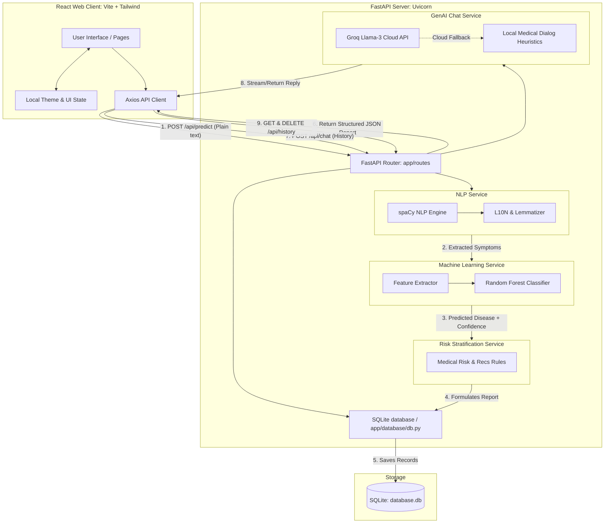

# AI-Driven Clinical Decision Support System (CDSS)

[](https://www.python.org/)
[](https://fastapi.tiangolo.com/)
[](https://react.dev/)
[](https://vite.dev/)
[](https://tailwindcss.com/)
[](LICENSE)

An intelligent, full-stack clinical decision support application designed for healthcare demonstration and technical evaluations. The system parses patient symptom complaints in plain natural language, extracts clinical symptom concepts using NLP, classifies probable diseases using a supervised Machine Learning classifier, evaluates patient clinical risk, and answers wellness-oriented follow-up questions using an AI chatbot helper.

---

## 📸 User Interface Showcase

The frontend features a modern, responsive user experience optimized for both standard and high-DPI displays. Visuals can be found in the [docs/screenshots](docs/screenshots/) folder:
- **Interactive Landing Dashboard**: Deep analytics breakdown, project specs, and quick links.
- **Symptom Analysis Interface**: Free-text symptom input form with clinical presets.
- **Interactive Reports**: Circular SVG confidence meters, risk level badges, and structured recommendations.
- **Conversational Chatbot**: Chat terminal with quick-prompt suggestions and custom rendering.
- **SQLite Database Viewer**: Dedicated history log panel with single-row deletion and bulk clear options.
- **Responsive Dark/Light Mode**: Smooth transitions synced with `localStorage`.

---

## 🏗️ Technical Architecture

The architecture below illustrates the data flow, services, and core technologies powering the application:



---

## 📂 Repository Organization

```
AI-Clinical-CDSS/
├── docs/
│   └── screenshots/            # App screenshots & visualization guidelines
│
├── backend/                    # FastAPI & Machine Learning API
│   ├── app/
│   │   ├── database/           # SQLite schema definitions & DB seed scripts
│   │   │   ├── db.py           # DB connection context & helper queries
│   │   │   └── database.db     # Local SQLite Database (Git ignored)
│   │   ├── models/             # Serialized ML model binaries
│   │   │   └── disease_model.pkl # Trained RandomForest model (Git ignored)
│   │   ├── routes/             # REST endpoints (Predict, Chat, History)
│   │   ├── services/           # Underlying ML, NLP, Risk, and Chat classes
│   │   ├── training/           # Offline datasets & model compilation
│   │   │   ├── train_model.py  # Classifier training pipeline
│   │   │   └── symptom_dataset.csv # Synthetic clinical training logs
│   │   └── main.py             # FastAPI entrypoint & middleware configs
│   ├── requirements.txt        # Backend python dependencies
│   ├── .env.example            # Environment variables template
│   └── README.md               # Backend documentation
│
├── frontend/                   # React Frontend Client
│   ├── src/
│   │   ├── assets/             # SVGs, icons, and logo assets
│   │   ├── components/         # Layout modules (Navbar, Footer, Toast)
│   │   ├── pages/              # Tab components (Home, SymptomAnalysis, Results, Chat, History)
│   │   ├── App.jsx             # Main container, layout & dark mode state
│   │   ├── index.css           # Global custom CSS styles & fonts
│   │   └── main.jsx            # DOM entrypoint
│   ├── package.json            # Node scripts & project dependencies
│   ├── tailwind.config.js      # Custom theme modifications
│   ├── vite.config.js          # Hot-reload and dev-server configuration
│   └── README.md               # Frontend documentation
│
├── .gitignore                  # Unified repository Git exclusion rules
├── LICENSE                     # MIT License
└── README.md                   # Project Master Document
```

---

## ⚡ Quick Start & Run Guide

To run the full-stack application locally, you will need **Python 3.10+** and **Node.js 18+** installed. 

### Step 1: Clone the Repository
```bash
git clone https://github.com/yourusername/AI-Clinical-CDSS.git
cd AI-Clinical-CDSS
```

### Step 2: Configure & Launch Backend
1. **Navigate to backend and create a Virtual Environment**:
   ```bash
   cd backend
   python -m venv .venv
   ```
2. **Activate the Virtual Environment**:
   * **Windows (PowerShell)**:
     ```powershell
     .venv\Scripts\Activate.ps1
     ```
   * **Linux / macOS**:
     ```bash
     source .venv/bin/activate
     ```
3. **Install Dependencies**:
   ```bash
   pip install -r requirements.txt
   ```
   *Note: spaCy will automatically download the English vocabulary corpus (`en_core_web_sm`) during setup, or it will fetch it on first execution.*
4. **Configure Environment Variables**:
   Copy the example file to `.env`:
   ```bash
   cp .env.example .env
   ```
   Configure the Groq API key:
   ```ini
   GROQ_API_KEY=your-api-key-here
   ```
   *Optional: If `GROQ_API_KEY` is not provided, the application automatically falls back to an offline rule-based medical dialog helper so the chatbot is fully functional.*
5. **Run the FastAPI server**:
   ```bash
   uvicorn app.main:app --reload
   ```
   - The backend initializes on [http://localhost:8000](http://localhost:8000).
   - If missing, the database is auto-generated and seeded with initial records.
   - If the ML model pickle file is missing, the backend automatically triggers model training from the CSV dataset and compiles `disease_model.pkl`.

### Step 3: Run Frontend
1. **Navigate to the frontend folder** (in a separate terminal):
   ```bash
   cd frontend
   ```
2. **Install Dependencies**:
   ```bash
   npm install
   ```
3. **Start Development Server**:
   ```bash
   npm run dev
   ```
   - Access the user interface at [http://localhost:5173](http://localhost:5173).

---

## 🔌 API Documentation

FastAPI automatically generates interactive Swagger documentation at [http://localhost:8000/docs](http://localhost:8000/docs). Below are the core REST endpoints:

### 1. Diagnostic Prediction
* **Endpoint**: `POST /api/predict`
* **Description**: Extracts symptoms from unstructured text, classifies the disease, scores risk, and registers the prediction in SQLite.
* **Request Payload**:
  ```json
  {
    "symptom_text": "I have been experiencing a high fever for three days, along with a dry cough and severe shortness of breath."
  }
  ```
* **Response Payload**:
  ```json
  {
    "predicted_disease": "COVID-19",
    "confidence": 92.4,
    "risk_level": "High",
    "symptoms_detected": [
      "fever",
      "cough",
      "shortness_of_breath"
    ],
    "nlp_severity": "severe",
    "recommendations": [
      "Isolate immediately to prevent spreading the infection.",
      "Monitor blood oxygen levels regularly.",
      "Consult a physician or telemedicine service for medical guidance.",
      "Seek emergency care if you experience severe breathing difficulty or persistent chest pain."
    ]
  }
  ```

### 2. GenAI Clinical Chatbot Helper
* **Endpoint**: `POST /api/chat`
* **Description**: Sends a conversational history stream to the Groq Llama-3 model or the local dialogue helper.
* **Request Payload**:
  ```json
  {
    "messages": [
      {
        "role": "user",
        "content": "What is the primary difference between Flu and COVID-19 symptoms?"
      }
    ]
  }
  ```
* **Response Payload**:
  ```json
  {
    "response": "While both Flu and COVID-19 are respiratory illnesses sharing common symptoms like fever and cough, COVID-19 is caused by SARS-CoV-2 and often features unique indicators such as loss of taste or smell, and a higher risk of severe complications like shortness of breath. The flu typically has a more rapid onset of muscle aches and sore throat."
  }
  ```

### 3. Patient History Management
* **Endpoint**: `GET /api/history`
  * **Description**: Retrieves all clinical predictions saved in the local database.
* **Endpoint**: `DELETE /api/history/{id}`
  * **Description**: Deletes a specific diagnostic report by database ID.
* **Endpoint**: `DELETE /api/history`
  * **Description**: Clears all records from the database history logs.

---

## 🧠 Core Machine Learning & NLP Pipeline

### 1. NLP Phrase Parsing & Lemmatization (spaCy)
The [nlp_service.py](file:///e:/Files/GITHUB/Al_Clinical_Decision_Support/backend/app/services/nlp_service.py) utilizes spaCy's `en_core_web_sm` English tokenizer. It cleans input queries, performs lemmatization (converting words to their root forms, e.g., "coughing" -> "cough"), and cross-references them against our standard symptom features:
* **Features matched**: `fever`, `cough`, `shortness_of_breath`, `chest_pain`, `headache`, `sore_throat`, `fatigue`, `body_ache`, `loss_of_taste_smell`, `runny_nose`.
* **Modifier Analysis**: The NLP service scans for severity adjectives (e.g., "severe", "critical", "extreme") to categorize the clinical complaint.

### 2. Random Forest Classification (Scikit-Learn)
When the application starts, it checks for a serialized classifier. If missing, [train_model.py](file:///e:/Files/GITHUB/Al_Clinical_Decision_Support/backend/app/training/train_model.py) dynamically compiles a supervised `RandomForestClassifier`:
* **Dataset**: A synthetic clinical dataset containing 750 patient records generated based on typical symptom probability matrices.
* **Training Details**: The data is split (80% training, 20% test), stratified by class.
* **Model Parameters**: 100 decision estimators, max depth of 8.
* **Metrics**: Typically reaches >90% validation accuracy on test partitions.

### 3. Rule-Based Clinical Risk Stratification
The [risk_service.py](file:///e:/Files/GITHUB/Al_Clinical_Decision_Support/backend/app/services/risk_service.py) takes the predicted disease, matched symptoms, and severity flags to assign a risk score:
* **High**: Triggered by symptoms like `shortness_of_breath` or `chest_pain`, or if the classifier outputs a high-risk prediction like Pneumonia.
* **Moderate**: Triggered by systemic features like a persistent `fever` combined with cough.
* **Low**: Localized mild symptoms such as simple headache or runny nose.

---

## 🗄️ Database Schema

The SQLite database (`database.db`) uses the following schema for storing patient logs:

| Column Name | Data Type | Key / Constraint | Description |
|---|---|---|---|
| `id` | `INTEGER` | `PRIMARY KEY AUTOINCREMENT` | Unique identifier for each report. |
| `predicted_disease` | `TEXT` | `NOT NULL` | The name of the predicted disease. |
| `confidence` | `REAL` | `NOT NULL` | Classifier confidence score (percentage). |
| `risk_level` | `TEXT` | `NOT NULL` | Stratified risk level (`Low`, `Moderate`, `High`). |
| `symptoms_detected` | `TEXT` | `NOT NULL` | JSON-serialized array of detected symptoms. |
| `recommendations` | `TEXT` | `NOT NULL` | JSON-serialized array of medical suggestions. |
| `timestamp` | `TEXT` | `NOT NULL` | ISO-formatted string representation of execution time. |

---

## ⚕️ Disclaimer

This software is built strictly for educational, demonstration, and recruitment review purposes. It does not provide professional medical diagnosis, advice, or real-world treatment plans. Do not use this application for actual medical self-assessment.

---

## 📄 License

This project is licensed under the MIT License - see the [LICENSE](LICENSE) file for details.
